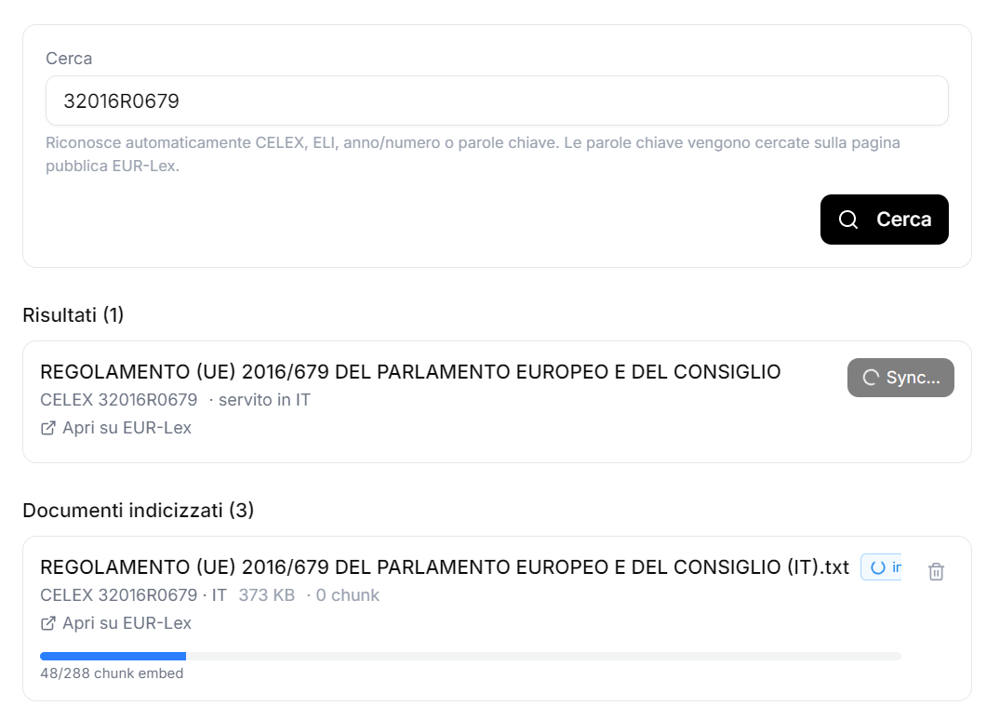

# MikeRust

Sovereign local AI document assistant — Rust+axum backend, SQLite, local filesystem storage, ONNX-based embeddings, Tauri shell, Next.js frontend (forked from [`willchen96/mike`][upstream] upstream).

Designed to run entirely on the user's machine: no cloud database, no external auth provider, no S3 bucket. Optional LLM API keys are stored locally and never leave the box except to call the model provider the user explicitly configured.

## Lineage

MikeRust derives from the open-source **Mike** project by Will Chen
([`willchen96/mike`][upstream]) — an AGPL-3.0 AI legal assistant with
a TypeScript / Express / Supabase / S3 / LibreOffice stack. We keep
the frontend largely intact (UI, chat panel, citations, document
viewer) and replace the backend with a Rust+axum implementation that:

  * uses SQLite (via [`sqlite-vec`](https://github.com/asg017/sqlite-vec))
    instead of Supabase + pgvector;
  * embeds locally with ONNX (multilingual-e5-base via fastembed +
    optional DirectML / QNN execution providers);
  * extracts PDF / DOCX / RTF / XLSX in pure Rust — no LibreOffice
    process spawn;
  * ships as a Tauri desktop app with no server-side dependency.

For the original cloud-native upstream, see
[github.com/willchen96/mike][upstream]. For a different sister fork
specialised on Danish law, see
[github.com/marklok/danishmike](https://github.com/marklok/danishmike).

[upstream]: https://github.com/willchen96/mike

## Interface

A desktop window (Tauri) wrapping the Next.js frontend; the embedded axum
backend runs in the same process. Two views to set expectations:

### Chat with citations and inline document viewer

![Chat answer with [g7] citation pill open in the PDF viewer, the cited passage highlighted on the page](docs/images/chat-with-citations.png)

Numeric citation pills (`[1]`, `[2]`, …) and `[gN]`/`[pN]` KB tags both open
the source document in the side panel. PDF.js text-search highlights the
exact quote the model cited. Re-opening a chat re-renders all pills from
persisted annotations — no stale `[Page N]` contamination thanks to a
sanitisation pass on both the write and read path.

### Authoritative-corpus sync (EUR-Lex shown)



Search by CELEX, ELI, year/number, or free-text keywords; the panel
auto-detects intent, probes EUR-Lex across all act types, and confirms
which actually exist in the requested language. Indexed rows show their
chunk count, status badge, and a live embedding progress bar driven by
`/eurlex/embed-progress` polling. Same shape for the Italian Legal
Corpus panel.

### Internationalisation

The UI is fully wired for i18n via
[`next-intl`](https://next-intl.dev/) — every user-facing string lives in
[`frontend/messages/`](frontend/messages/). Currently shipped: **English
(`en.json`) and Italian (`it.json`)**. Adding a locale is one translation
file plus an entry in the locale picker.

> ⚠️ Development and screenshots use the UI in **Italian** — that's the
> source-of-truth surface for visual review and copy iteration. The English
> locale is kept current but typically lags by one or two iterations on
> brand-new strings. Contributors adding UI: add the IT key first, then the
> EN equivalent. **Never hardcode user-facing strings**, always go through
> a `useTranslations` namespace key.

## Quick start

```bash
# 1. pdfium (PDF extraction)
# Download from https://github.com/bblanchon/pdfium-binaries/releases
# Place pdfium.dll / libpdfium.so / libpdfium.dylib in libs/pdfium/

# 2. Backend env
cp .env.example .env
# Edit .env: set JWT_SECRET. STORAGE_PATH, DATABASE_URL etc. have sensible defaults.

# 3. Run dev (Tauri shell + axum backend + Next.js frontend)
cd src-tauri && cargo tauri dev

# Or backend only:
cargo run --features rag
```

The first run will:
- create `data/db/mike.db` (SQLite) and apply all migrations
- create `data/storage/` (uploads, chat cache)
- download `multilingual-e5-base` ONNX weights (~280 MB) into `%USERPROFILE%/mikerust-data/fastembed/` on first scan / first chat with attachments

## Architecture

```
Browser / Tauri webview (Next.js :3000)
       │  HTTP + SSE
       ▼
axum backend (:3001)
   ├── SQLite          mike.db          (schema, vector store, settings)
   ├── sqlite-vec      doc_chunks       (768-dim embeddings, partition-keyed)
   ├── fastembed/ort   multilingual-e5-base ONNX  (CPU / DirectML / QNN)
   ├── pdfium-render   PDF text extraction + page rendering
   ├── quick-xml+zip   DOCX extraction (incl. redline detection — see below)
   ├── rtf-parser      RTF text extraction
   ├── calamine        XLSX/XLS/XLSB/ODS extraction
   ├── Local storage   ./data/storage/{documents,cache}
   ├── LLM             Anthropic / Gemini / OpenAI / vLLM / Ollama
   └── MCP             any HTTP/SSE MCP server, including localhost
```

## Key features

### RAG: local folder sync
Configure folders under **Impostazioni → Documenti locali**. The scanner walks the tree (honouring `.gitignore`-style patterns), extracts text per format, chunks at ~800 tokens with 200-token overlap, and embeds with `multilingual-e5-base` (768 dims). Embeddings live in `sqlite-vec` virtual tables in the same `mike.db`. Search queries use cosine over the partitioned vector index; partitions are keyed by `(user_id, project_id_or_global)` so cross-tenant retrieval is impossible.

Supported formats:
- **PDF** — pdfium-render native text. Per-page extraction; pages stamped with `[Page N]` markers so chunks can carry locality metadata. Scanned PDFs (no embedded text) are skipped unless a vision LLM is configured.
- **DOCX** — pure Rust ZIP+XML. Detects tracked deletions (`<w:del>`) and strike-through formatting (`<w:strike/>`/`<w:dstrike/>`); both are surfaced inline as `[removed by author: …]` markers. See [docs/DOCX.md](docs/DOCX.md).
- **RTF** — `rtf-parser` body text (control words, font tables, pictures, fields stripped).
- **XLSX / XLS / XLSB / ODS** — `calamine` per-sheet flattening.
- **TXT / MD / CSV** — UTF-8 lossy decode.
- **Images / scanned PDFs** — surfaced via the chat composer's vision path when the selected model is vision-capable; not indexed for RAG.

### RAG: hardware acceleration
ONNX Runtime execution providers compiled in via opt-in features:

```bash
cargo build --features rag-directml   # Windows GPU (DX12 device, no extra SDK)
cargo build --features rag-qnn        # Qualcomm Snapdragon NPU (X Elite / 8 Gen 3)
```

The service tries QNN → DirectML → CPU, silently skipping providers whose DLLs aren't loadable.

### Chat with attachments — hash-keyed cache
Documents attached via the chat composer (the **+** button) land in `data/storage/cache/` keyed by SHA-256 of the binary, and are pre-extracted to plain text at upload time:

```
data/storage/cache/<hash>.<ext>     # original file
data/storage/cache/<hash>.txt       # extracted plain text
```

Effects:
- **Dedup across chats** — the same file uploaded in different chats reuses the same on-disk pair (multiple `documents` rows reference one hash).
- **No filename collisions** — two different chats can both have a file named `contratto.pdf`; the hash determines the path, not the user-facing filename.
- **Auto re-extract on edit** — modifying a docx changes its hash, so the next upload generates a fresh `.txt` instead of stale text.
- **Chat-delete cleanup** — when a chat is deleted, the backend ref-counts each `content_hash` of its linked docs and removes the on-disk binary + text only when no other doc still references that hash.

See [docs/CACHE.md](docs/CACHE.md) for the storage contract and migration history.

### Citations
Assistant responses inline numeric markers (`[1]`, `[2]`) plus a trailing `<CITATIONS>` JSON block. The frontend parses both:
- **Per-marker pills** — `AssistantMessage.tsx::preprocessCitations` maps each `[n]` to the matching annotation by `ref` (numeric) or `doc_id` (alphanumeric `[g1]`/`[p1]` from KB hits).
- **DocPanel jump** — clicking a pill opens the cited doc in the in-app viewer, scrolling to the cited page (PDFs) or section (DOCX).

Annotations are persisted on `messages.annotations` (migration 0012) so re-opening a chat re-renders all pills correctly. Page-marker contamination (`[Page N]` leaking into citation quotes) is sanitised on both write and read paths so PDF.js text-layer highlights work.

When the model skips the `<CITATIONS>` block (some providers do), `synthesise_kb_citations_from_markers` rebuilds citations from RAG hits keyed by `(g|p)<n>` tags in the response.

### Local-folder sync
**Impostazioni → Documenti locali** (formerly "Sincronizzazione"). Add a folder, optionally scope to a project, hit *Scansiona ora*. Scanner emits per-file progress over the `/sync/folders/:id/status` endpoint with coarse pipeline stages (`extracting`, `embedding`) so the user sees motion during the slow first PDF.

The embedding model state — including the one-shot ~280 MB download — is reported via `/sync/model-status`; the UI renders an amber progress bar above the folder list while in `downloading` or `loading` state.

### Authoritative legal corpora (planned)
Optional ingestion of public legal sources, configured per-corpus under the same settings menu. See [docs/CORPORA.md](docs/CORPORA.md) for the API survey and per-corpus implementation status:

| Corpus | API | Languages | Status |
|---|---|---|---|
| **EUR-Lex** (EU) | REST/SOAP + SPARQL + Cellar | 24 EU languages | ✅ V1 — CELEX fetch via public HTML, EN fallback |
| **Italia legale** (HF dataset) | HF datasets-server `/rows` + Parquet bulk | Italian | ✅ V1 — Normattiva (~69K) + Corte Costituzionale (~22K) |
| Italian: OpenGA (TAR + Consiglio di Stato) | Same dataset, source filter | Italian | 🔲 in dataset, opt-in mancante |
| Italian: Cassazione (civile/penale/sez. unite) | da identificare | Italian | 🔲 V2 — sorgente fuori dataset HF |
| Italian: Normattiva post-snapshot live | URN single-fetch | Italian | 🔲 V2 — atti dopo 2026-03-01 |
| Italian: Leggi regionali (20 BUR) | per-regione | Italian | 🔲 V3 |
| Italian: Gazzetta Ufficiale (sumario quotidiano) | XML feed | Italian | 🔲 V3 |
| Italian: Decreti ministeriali / circolari | per-ministero | Italian | 🔲 V3 (import da URL) |
| **Retsinformation** (Denmark) | JSON `/api/document/{eli}` + `/api/search` | Danish | planned |
| **Légifrance** (France, via PISTE) | OAuth2 REST | French | planned |
| **BOE** (Spain) | Open Data API + daily XML sumarios | Spanish | planned |
| **Gesetze im Internet** (Germany) | TOC XML → per-law ZIP | German | scraping-only |
| **Normattiva** (Italy, direct) | none — HTML / Akoma Ntoso URN deep links | Italian | sostituito dal connettore HF; resta utile come V2 live-fetch |

### Sovereign data
Everything that contains user data lives under the workspace:
- `data/db/mike.db` — schema, embeddings, settings, all chats, all documents metadata
- `data/storage/` — uploads (`documents/`), chat cache (`cache/`)
- `%USERPROFILE%/mikerust-data/fastembed/` — ONNX weights (out-of-tree to avoid the Tauri watcher)
- `data/.mikeprj` envelopes — AES-256-GCM-encrypted project bundles, key derived via Argon2id from a recipient email

No telemetry, no remote logging, no anonymous metrics. Outbound traffic only when the user explicitly invokes a remote LLM (Anthropic / Gemini / OpenAI) or a remote MCP server they configured themselves.

## Environment variables

See `.env.example` for the full reference.

| Variable | Required | Default |
|---|---|---|
| `JWT_SECRET` | **yes** | — |
| `DATABASE_URL` | no | `sqlite://data/db/mike.db` |
| `STORAGE_PATH` | no | `./data/storage` |
| `FASTEMBED_CACHE_DIR` | no | `%USERPROFILE%/mikerust-data/fastembed` |
| `PDFIUM_DYNAMIC_LIB_PATH` | no | walks ancestors of cwd / exe for `libs/pdfium/` |
| `VLLM_BASE_URL` | for local LLM | — |
| `VLLM_API_KEY` | no | `local` |
| `ANTHROPIC_API_KEY` | for Claude | — |
| `GEMINI_API_KEY` | for Gemini | — |
| `MCP_SERVERS` | no | `[]` |

## Implementation status

| Area | Status |
|---|---|
| Auth (PIN/Argon2id + Windows Hello biometric + opaque sessions) | ✅ |
| SQLite + migrations (0001 → 0014) | ✅ |
| Local storage (filesystem) + S3 trait | ✅ filesystem ; 🔲 S3 |
| PDF extraction (pdfium) + scanned-PDF detection | ✅ |
| DOCX extraction with redline detection | ✅ |
| RTF / XLSX / TXT / MD / CSV extraction | ✅ |
| RAG: scanner, chunker, sqlite-vec, fastembed CPU | ✅ |
| RAG: DirectML / QNN execution providers | ✅ opt-in |
| LLM: Anthropic / Gemini / OpenAI / vLLM / Ollama | ✅ |
| MCP client (HTTP/SSE) | ✅ |
| Routes: auth, user, chat, documents, projects, workflows, sync, tabular-review | ✅ |
| Chat citations with persistence | ✅ |
| Chat-attachment hash cache + ref-counted cleanup | ✅ |
| `.mikeprj` AES-256-GCM project export | ✅ |
| Authoritative-corpus framework (`LegalCorpusAdapter` trait) | ✅ |
| EUR-Lex V1 (CELEX-based fetch + 24-language picker + EN fallback) | ✅ |
| EUR-Lex V2 (full-text search via SOAP CWS) | 🔲 [registration required](docs/EURLEX_REGISTRATION.md) |
| Italia legale V1 (Normattiva + Corte Cost via HF dataset) | ✅ |
| Italia legale V2 (OpenGA opt-in, Cassazione, live Normattiva) | 🔲 see [CORPORA.md](docs/CORPORA.md) |
| Italia legale V3 (regional laws, GU, ministerial decrees) | 🔲 |
| Other corpus ingestors (Retsinformation, Légifrance, BOE, ...) | 🔲 planned |

## Documentation

- [docs/MANUAL.md](docs/MANUAL.md) — operator manual (running, troubleshooting, recovery)
- [docs/DOCX.md](docs/DOCX.md) — DOCX extraction details (tracked changes, strikes, namespaces)
- [docs/CACHE.md](docs/CACHE.md) — chat-attachment cache layout + ref-counting
- [docs/CORPORA.md](docs/CORPORA.md) — EUR-Lex + national legal-corpora plan + API survey
- [docs/EURLEX_REGISTRATION.md](docs/EURLEX_REGISTRATION.md) — EUR-Lex V1 (no auth) + V2 SOAP registration steps
- [docs/SESSION_RECAP.md](docs/SESSION_RECAP.md) — historical session notes
- For the pristine upstream README, see [`willchen96/mike`][upstream] directly

## License

Inherits AGPL-3.0 from the upstream [`willchen96/mike`][upstream] frontend. Backend (`src/`, `src-tauri/`) is original Rust and ships under the same license for consistency. See `LICENSE`.
